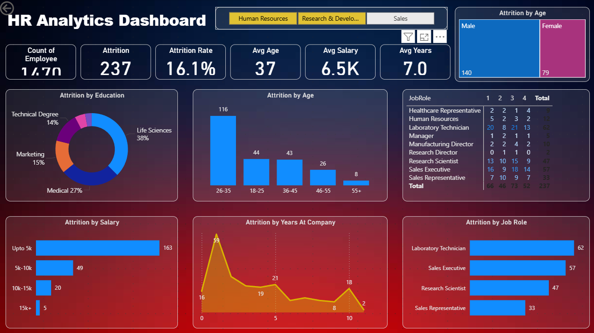

# HR Analytics Dashboard 📊

## Overview

This project presents an interactive **HR Analytics Dashboard** developed using **Power BI** to analyze employee attrition and workforce trends. The dashboard helps HR professionals and business leaders understand key factors contributing to employee turnover and supports data-driven retention strategies.

---

## Business Problem

Employee attrition can significantly impact organizational productivity, recruitment costs, and employee morale. Understanding the factors influencing employee turnover is essential for improving workforce retention and planning.

This dashboard aims to answer key questions such as:

* Which employee groups experience the highest attrition?
* How does attrition vary across age groups, salary levels, and job roles?
* Which departments are most affected by employee turnover?
* What workforce trends can help improve retention strategies?

---

## Dashboard Preview



---

## Key Performance Indicators (KPIs)

| KPI                      | Value |
| ------------------------ | ----- |
| Employee Count           | 1470  |
| Attrition Count          | 237   |
| Attrition Rate           | 16.1% |
| Average Age              | 37    |
| Average Salary           | 6.5K  |
| Average Years at Company | 7     |

---

## Dashboard Features

### Employee Attrition Overview

* Employee Count
* Attrition Count
* Attrition Rate
* Average Age
* Average Salary
* Average Years at Company

### Attrition Analysis by:

* Age Group
* Education Field
* Salary Slab
* Job Role
* Gender
* Years at Company

### Interactive Filters

* Human Resources
* Research & Development
* Sales

Users can dynamically filter and explore attrition trends across departments.

---

## Key Insights

* Employees aged **26–35** show the highest attrition.
* Lower salary bands experience significantly higher employee turnover.
* Certain job roles contribute disproportionately to overall attrition.
* Most employee exits occur during the early years of employment.
* Attrition patterns vary across departments and workforce segments.

---

## Tools & Technologies Used

* Power BI
* DAX
* Data Modeling
* Data Visualization
* Business Intelligence
* HR Analytics

---

## Skills Demonstrated

* Dashboard Development
* KPI Design
* Data Cleaning & Transformation
* Data Modeling
* DAX Calculations
* Business Analysis
* Data Storytelling
* HR Metrics Analysis

---

## Business Impact

This dashboard enables organizations to:

* Identify high-risk employee segments
* Understand attrition drivers
* Improve workforce retention strategies
* Support HR decision-making
* Enhance workforce planning initiatives

---

## Project Structure

```text
HR-Analytics-Dashboard/
│
├── HR_Analytics.pbix
├── README.md
├── Images/
│   ├── hr_dashboard.png
│   └── dashboard_demo.mp4
│
└── dataset/
    └── HR_Analytics.csv
```

---

## Dashboard Walkthrough

🎥 [Watch Dashboard Demo](Images/dashboard-demo%20.mp4)

---

## Future Enhancements

* Attrition Prediction using Machine Learning
* Employee Satisfaction Analysis
* Recruitment Analytics Dashboard
* Workforce Diversity & Inclusion Metrics
* Advanced Drill-through Reports

---

## Author

**Akanksha Agre**

Aspiring Data Analyst | Power BI | SQL | Python | Data Visualization

If you found this project interesting, feel free to connect with me on LinkedIn and share your feedback.
